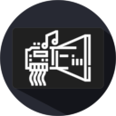

# About Soundboard4MacroDeck2 
  

***
*This is a plugin for Macro Deck 2, it does NOT function as a standalone app*
***
## Create your own soundboard
Create a button and configure your audio file.

You may choose either a local file or one from the web (please check you have permission, first!)

***
## Features

| Action | Description | Function |
| --- | --- | --- |
| Play | Standard play action | Plays audio until finished or another has started. Pressing multiple times will restart playback. |
| Play/Stop | Enhanced play action | Plays audio until the button is pressed again, or audio has finished or another file has started. |
| Overlap | Overlapped audio playback | Plays audio over other currently playing sounds until finished or another non-overlapping file has started. |
| Loop | Looped playback | Plays audio in loop until stopped or another file has started |

More features/actions coming soon...

***
## Need this in your language?
This plugin has its own localization files, independent of Macro Deck.
If your language is not available, the plugin will default to English.

Check the files available in source under [Resources/Languages](Resources/Languages).
If your language is missing or incomplete, please consider helping me out by creating a pull request with the translated file!

Currently available languages:
- English
- Italian
- German (thanks to @SuchByte)
- Spanish (seeking translator)

***
## Third party licenses
This plugin makes use of:
- [Macro Deck 2 by SuchByte (Apache License 2.0)](https://macrodeck.org)
- [NAudio by Mark Heath (MIT License)](https://github.com/naudio/NAudio)
- [Myrmec by rocketRobin (forked) (Apache License 2.0)](https://github.com/PhoenixWyllow/myrmec/)

Icon is a merge of the Macro Deck 2 icon by SuchByte and sound blaster by Anatolii Babii from the Noun Project.
***
