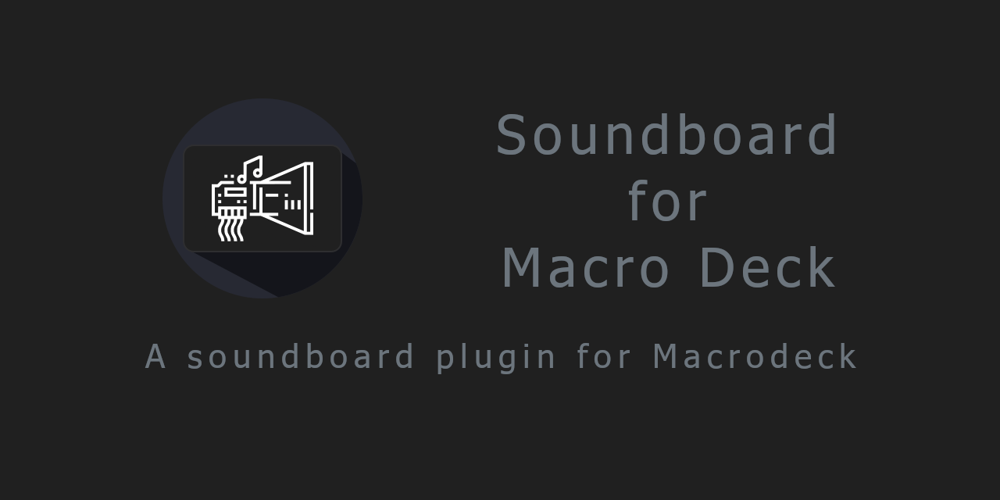
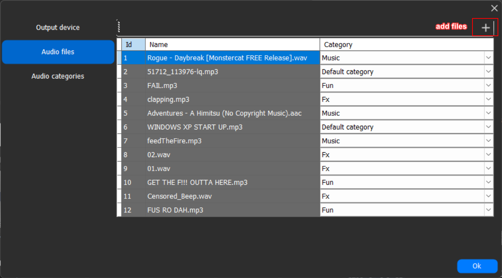
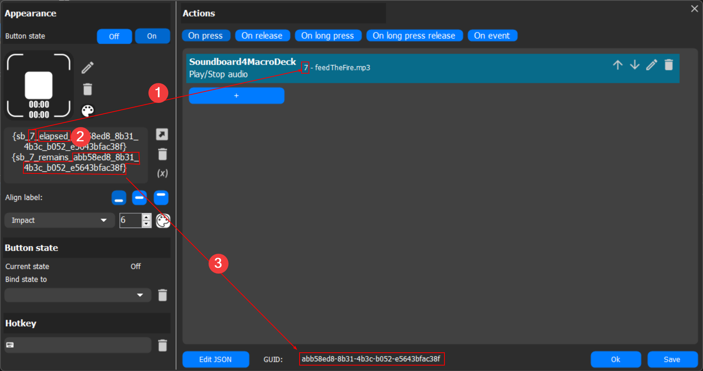

***
*This is a plugin for Macro Deck 2, it does NOT function as a standalone app*
***
## Create your own soundboard
Create a button and configure the audio file you want to play.

You can also configure the use of other output sound devices or Voicemeeter virtual devices to play your audio.

You may choose either a local file or one from the web (please check you have permission, first!)

***

## Features

Currently the plugin supports only the following file types: \
```aif, aiff, mid, midi, m4a, mp3, ogg, oga, aac, flac, wma, wav``` \
*Please open a request for any other file types you require.*

**If you get an error, please make sure the path is correct or your connection hasn't dropped, and that the file is the correct type.** \
For example, some files may have the mp3 extension but are found to be in mp4 format when the file signature is checked.\
*The plugin checks file signatures, not the file extension, because the web is a scary place.*

| Action | Description | Function |
| --- | --- | --- |
| Play | Standard play action | Plays audio until finished or another has started. Pressing multiple times will restart playback. |
| Play/Stop | Enhanced play action | Plays audio until the button is pressed again, or audio has finished or another file has started. |
| Overlap | Overlapped audio playback | Plays audio over other currently playing sounds until finished or another non-overlapping file has started. |
| Loop | Looped playback | Plays audio in loop until stopped or another file has started. |
| Stop all | Stop playback | Stops all currently playing audio. |
| Random from category | Random playback | Plays an audio file at random from the chosen category. |

***

## Audio file storage

Audio files are kept with the plugin database - all audio is loaded from the soundboard configuration, not from local files or the web.

This allows for portability of the soundboard and use of Macro Deck as a portable app.

In the revamped configuration screen you will see 2 new sections related to "audio files" and "audio categories":



Click on the `+` icon to add a file or category in the relevant section. You may also add files from the button configuration window.

You can change the file name, the file category, and the category name at any time.

***

## Time Variables

### Total time

**Written in the format "sb\_`id`"**

This will always be the length of the audio track.

### Playback

**Written in the format: "sb\_`[id]`\_`[elapsed|remains]`\_`[button guid]`"**

> Note: \
> These are only available for the Play and Play/Stop actions.\
> The variables list won't show these variables until the button has been played at least once.



1. The audio file id
1. The time `elapsed` or remaining (`remains`) for the button
1. The button GUID as found at the bottom of the button configuration window (using `_` not `-`)

***

## Need this in your language?
This plugin has its own localization files, independent of Macro Deck.\
If your language is not available, the plugin will default to English.

Check the files available in source under [Resources/Languages](Resources/Languages).\
If your language is missing or incomplete, please consider [helping me out by translating](https://crowdin.com/project/soundboard4macrodeck2/invite?h=e5ad788cc5280bebf974497ff551d7901946848)! 

Currently available languages:
- English
- Italian
- German (thanks to @SuchByte)
- Spanish (thanks to Duplino)
- Russian (thanks to Senk)
- Portuguese (thanks to Anderson)

***

## Third party licenses
This plugin makes use of:
- [Macro Deck 2 by SuchByte (Apache License 2.0)](https://macrodeck.org)
- [NAudio by Mark Heath (MIT License)](https://github.com/naudio/NAudio)

## Special thanks
- [Myrmec by rocketRobin (Apache License 2.0)](https://github.com/rocketRobin/myrmec) - a partial implementation and rework is included in this project under MimeSniffer

Icon is a merge of the Macro Deck 2 icon by SuchByte and sound blaster by Anatolii Babii from the Noun Project.